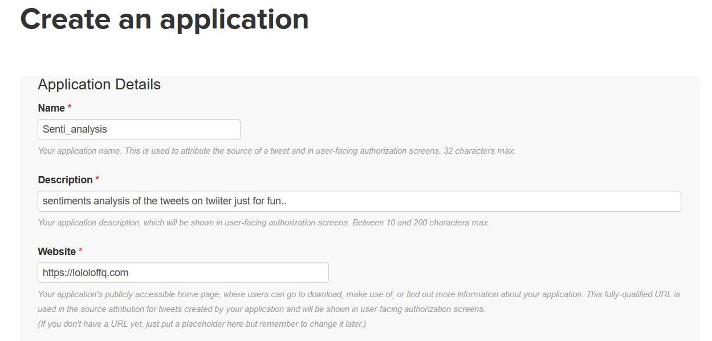
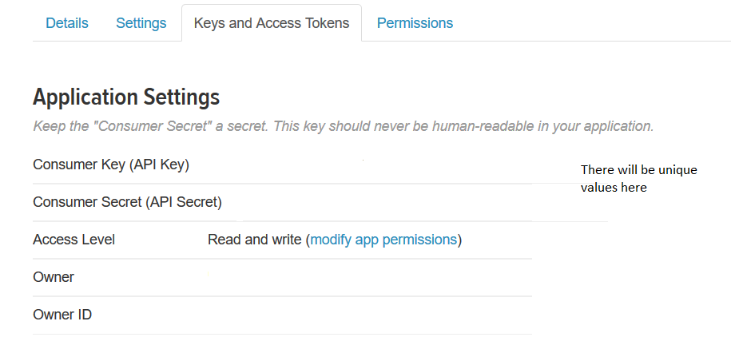
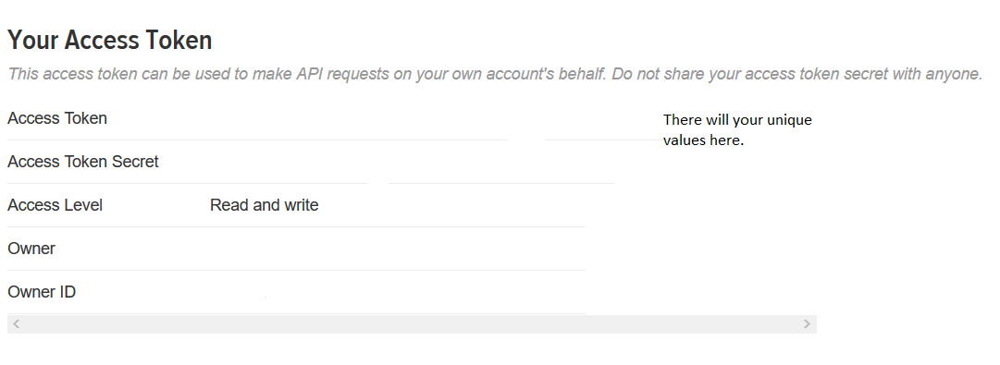
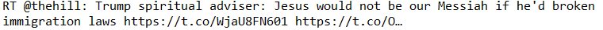
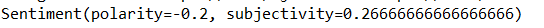

# Twitter-Sentiment-Analysis-Using-Twitter-API

###### Go [here](https://apps.twitter.com/).

###### Login with your twitter account.

###### Make sure you have a validated twitter account with a phone number and such.

###### Next create a project with a suitable name.It also asks for a url in which you can write anything.Just make sure to write a random url starting with (https://).

###### Next click on create the Customer_Key,customer_secrets and access tokens.

###### Copy the code in the IDE and paste your keys and access tokens in the code.

###### I searched for the Word "Trump" but you can search for anything.

###### After running the code successfully, you will see the tweets with polarity and subjectivity.Polarity is between -1 to +1 which tells us just positive or negative the sentiment of a particular tweet is.And subjectivity tells us just how much of a opinion it is Vs how much factual.

